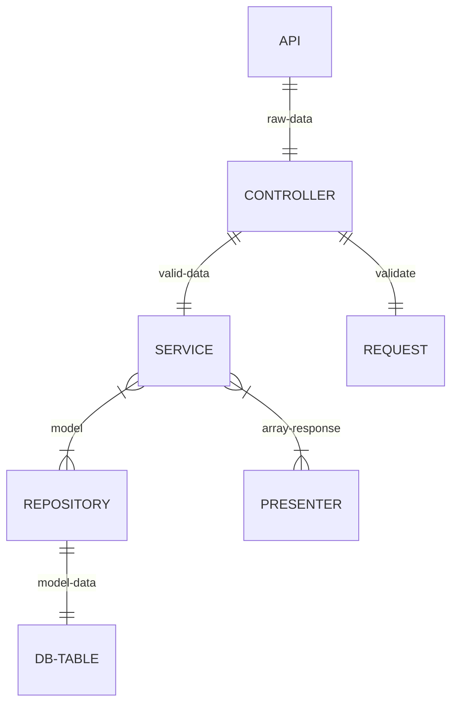

# COLOS

# About project
COLOS is an application for your shipments tracking. There are different roles in app such as a dispatch operator, regular user, and project client. The functionality for each role has been limited or expanded depending on the role. Each shipment can be tracked on a map with an accurate location calculation and movement history

# Technology stack
- PHP 8.0
- Laravel 8.0
- MySQL
- wkhtmltopdf
- Google Charts

# Code Architecture


# Features
- PDF reports with charts [example](/example/cckpi.blade.php)
- Integration with another system for updating data [example](/example/CckpiService.php)

# Creatig PDF reports with charts

For creating PDF reports we used Laravel Blade templates with wkhtmltopdf and Google Charts in it


# Uploading data to DB from JSON file

To upload data to the database, we used the halaxa/json-machine package

Function to upload data

```php
public function upload($cckpi)
{
    $content = Items::fromFile($cckpi->getPathName(), ['decoder' => new ExtJsonDecoder(true)]);
    foreach ($content as $item) {
        if (!isset($item['Year']) || !isset($item['Month'])) {
            return $this->errValidate('Parse error, make sure that Year and Month provided');
        }
        $item = $this->getCckpiFields($item);
        $tkpi = $this->repository->getByYearAndMonth($item['Year'], $item['Month'], $item['CompanyClientID']);
        if (is_null($tkpi)) {
            $this->repository->store($item);
        }
        else {
            $this->repository->update($tkpi, $item);
        }
    }
    return $this->ok();
}
```